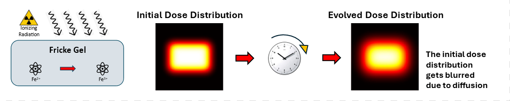

# Physics-Informed Neural Network for diffusion correction in Fricke gel
## Diffusion in Dose Distribution

Dose distribution can be measured in several ways using different dosimetric techniques. One promising technique exploits the use of chemical dosimeters, also known as Fricke gels. A Fricke gel is made from a solution of iron sulfate embedded in a gel matrix. When ionizing radiation interacts with a Fricke gel, ferrous ions ($Fe^{2+}$) are oxidized into ferric ions ($Fe^{3+}$). Exploiting its paramagnetic properties, $Fe^{3+}$ can be mapped using MRI or optical scans, where the measured signals are proportional to the absorbed dose.\
Although their motion is strongly hindered by the gel matrix, $Fe^{3+}$ diffusion cannot be completely suppressed. This results in blurring of the measured distributions, with an amplitude that depends on the time interval between irradiation and measurement. Since MRI or optical scanners are not usually freely available immediately after irradiation, ion diffusion limits the clinical use of Fricke gels.

Physics-Informed Neural Networks can be trained to recover the initial dose distribution, given the diffused distribution and the diffusion coefficient.
To apply this technique, we first need an experimental setup. 

The [Jupyter notebook](Fricke_gel.ipynb) shows how to model and simulate dose distributions affected by diffusion.