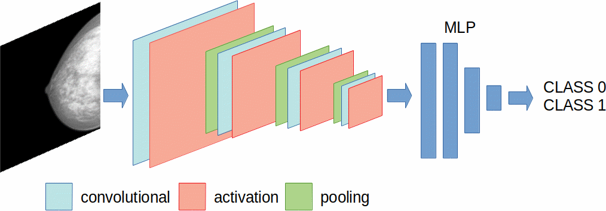
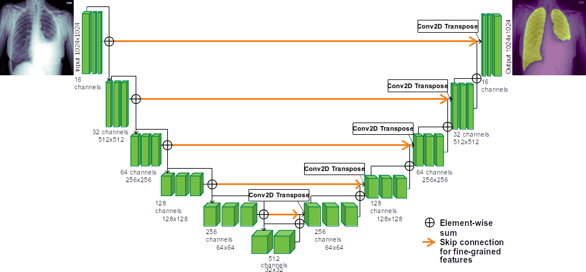

# **Lung Segmentation on Chest X-Ray images with U-Net**

Chest X-Ray (CXR) imaging is a radiographic procedure that produces 2D images of the chest. When we want to analyze the lungs on this kind of images it is important to delete the unuseful information that may be contained in the image. A typical CXR looks like this:

It is clear that there are many pixels that do not belong to lungs. So it is important to segment the lungs. In this exercise you will learn how to build, train and test a U-Net for lung segmentation. The network we are going to implement can be easly adapted to any other segmentation problem. So, let's see together what a U-Net is.
U-net (cita ronnerberger) is a Fully Convolutional Neural Network (FCNN) and it is the state-of-the-art algorithm for medical segmentation. The term FCNN means that there are not dense layers (Multi-Layer Perceptron) at the end of the Network. Just to let you understand the difference:

- Suppose we have a standard Convolutional Neural Network for binary classification of images. We expect that the newtork architecture is made by several Convolutional, Pooling or Strided Convolutional layers, activation layers and so on. At a certain point of the architecture, we flatten the input by using a simple flattening or a Global Average Pooling for example. Once we reduced the size of the tensor to one dimension, we use dense layer to let our CNN classify the input images:

- In a Fully Convolutional Neural Network (FCNN), we perform a pixel-wise classification: image segmentation means to give to each pixel a class (in our case lung or background). The structure of the U-Net mirrors the structure of an autoencoder: the left part, also called compression path, is an encoder that compress the information with a CNN and the right part, called decompression path, is a decoder that upsample the encoded information in order to return an image with the same size of the input one. However, there are important differences between autoencoder and U-Nets. What are the differences?

In this exercise, you will learn to build, train and evaluate a CNN for lung segmentation on Chest X-Ray images. Moreover, you will be introduced to a possible structure of a such complex network. In fact, we won't use a single jupyter notebook to develop the code but we will see many parts of the training framework.

Note: the images have already been pre-processed since their pre-processing requires time (about 2 hours). 
For your knowledge, the datasets we are going to use were collected to study tuberculosis. These datasets contain Chest X-Ray images and lung masks. The first
one is the Shenzhen dataset, containing CXR images acquired as part of the routine care at Shenzhen Hospital (Guangdong Medical College, China) and released in JPEG format. There are 340 normal X-Rays and 275 abnormal X-Rays showing various manifestations of tuberculosis. The second one is the Montgomery dataset, which has
been collected in collaboration with the Department of Health and Human Services, Montgomery County, Maryland, USA. The set contains 138 frontal chest X-Rays from Montgomery County’s Tuberculosis screening program, of which 80 are normal cases and 58 are cases with manifestations of TB. 

We aggregated the two datasets and pre-processed the images this way:
- images underwent a contrast stretching between their 5𝑡ℎ and 95𝑡ℎ percentile and normalized. 
- some images present black borders, we crop and resized them to 256x256 size.

In this exercise, we do not apply data augmentation because it will increase training time. You can develop your data augmentation in real-time during training as a further advancement.

The software has to have this structure:
- [a datagenerator ](Data_Generator/DataGenerator.ipynb)
- [the architecture](UNet_Arch/UNET_architecture.ipynb)
- [the loss and metrics](Loss_Metrics/LossMetrics.ipynb)
- [the training module](./Train_UNET.ipynb)
- [the inference and evaluation module](./Predict_UNet.ipynb)

## DATA GENERATOR

When we deal with a small amount of data we can use different ways to upload the data and give them as input to a Neural Network. If the data set is small enough, it can be loaded in a numpy array. When we deal with images, sometimes it is not possible to use this modality because we will saturate the RAM. For this reason we can use a data generator based on the Keras class Sequence to load only one batch per iteration instead of loading the entire dataset at once.

In Keras it is possible to use a simple built in generator, called  [ImageDataGenerator](https://www.tensorflow.org/api_docs/python/tf/keras/preprocessing/image/ImageDataGenerator), which is a generator that that can be used for classification task. We saw the functioning of such function in the last editions of the ML-INFN Hackathon.

It may happen that our data cannot be read with the ImageDataGenerator function or that we want to train an algorithm for tasks like regression or segmentation.
In this [notebook](Data_Generator/DataGenerator.ipynb) you will see a customized data generator for segmentation.

The goal of this part of the exercise is to broadly understand its functioning.

## THE ARCHITECTURE

In this part of the exercise you have to write the architecture of the U-Net. As you will see in the [notebook](UNet_Arch/UNET_architecture.ipynb), there are some parts that need to be filled. 
The [U-Net](https://arxiv.org/abs/1505.04597) was proposed for the medical image segmentation. The name U-Net is due to the fact that the whole architecture can be represented with a U shape:

The left part is called compression path since its task is to compress the input data through strided convolution or pooling. The right part is called decompression path and it transforms the compressed information through deconvolution or upsampling in order to upsample the information till the input size. 
A peculiarity of the U-Net are the skip connections: the output of a left block is concatenated to the input of the correspondent right block. So, when we write the architecture we should be careful to the sizes of the outputs of the compression path and the inputs of the decompression path: they have to be the same!
Hint: a smart choice to match the sizes is to use the same size for stride/pooling on the left path and for the upsamling/deconvolution in the right path.

It is important also to let the U-Net have a good generalization capability: we suggest to use both batch normalization and spatial dropout (at the end of the block).

In this part of the exercise, you have to write the single module (function) for the decompression path and to write the whole architecture using the defined functions. 

# LOSS AND METRICS

As any supervised training we have to define the loss functions and the metrics we want to use to train the algorithm. 

In this part of the [exercise](Loss_Metrics/LossMetrics.ipynb), we just want you to understand the meaning of the Dice Similarity Coefficient (DSC) and how we can use it as loss function and metrics. 

# TRAINING

Once we defined the architecture and the loss and metrics we can finally train the U-Net. First, we divide the data into training, validation and test set. 
Then you have to call the datagenerator we wrote before and set its parameters. We will use also some Keras callbacks that are described in the [notebook](./Train_UNET.ipynb).
Lastly, you have to call the model, compile and train it.

# INFERENCE AND EVALUATION

Lastly, once the U-net have been trained we can compute the predictions on the test set in order to visualize if the segmentation is as expected. 

You will find how to do this in this [notebook](./Predict_UNet.ipynb)

## The Data

* [128*128](https://pandora.infn.it/public/f10e06)
* [256*256](https://pandora.infn.it/public/88b1cf)
* [512*512](https://pandora.infn.it/public/ced7f7)
